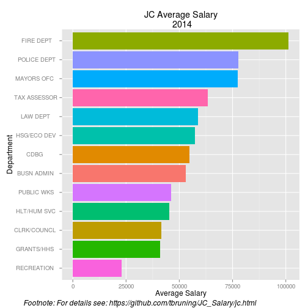

### Required packages

```r
require(dplyr)
require(tidyr)
require(knitr)
require(ggplot2)
require(gridExtra)
```
### Source file

```r
fileURL <- "https://data.openjerseycity.org/dataset/d18a7e84-d236-4510-a905-361d7153215f/resource/0c375385-c622-42a6-878b-b6a178d4182a/download/jerseycitypublicemployeeswithtitlesandhiredates20feb2014.csv"

download.file(fileURL, destfile = "./data/jcdata.csv", method = "curl" )
dateDownload <- date()
dateDownload
```
This file was downloaded: Fri Jun  5 19:05:14 2015.

### Processing

```r
df_local <- tbl_df(read.csv("./data/jcdata.csv", stringsAsFactors = FALSE ))
df_sep <- df_local %>% 
    separate(SALARY, c("D", "C"), sep = 1) %>% 
    separate(C, c("E", "G"), sep = ",", extra = "merge") %>% 
    unite(SALARY, E, G, sep = "") %>% 
    separate(LOCD, c("Dept", "J"), sep = "‐", extra = "merge") 
df_sep <- group_by(df_sep, Dept)
df_sep$SALARY <- as.numeric(df_sep$SALARY)
df_summ <- summarise(df_sep, Mean = mean(SALARY, na.rm = TRUE))
df_summ$Mean <- round(df_summ$Mean, digits = 0)
arrange(df_summ,desc(Mean))
```

```
## Source: local data frame [13 x 2]
## 
##            Dept   Mean
## 1  FIRE DEPT    101229
## 2  POLICE DEPT   77635
## 3  MAYORS OFC    77344
## 4  TAX ASSESSOR  63504
## 5  LAW DEPT      58719
## 6  HSG/ECO DEV   57391
## 7  CDBG          54697
## 8  BUSN ADMIN    53110
## 9  PUBLIC WKS    46164
## 10 HLT/HUM SVC   45225
## 11 CLRK/COUNCL   41500
## 12 GRANTS/HHS    40952
## 13 RECREATION    22893
```

### Plot Generation and Display

```r
p1 <- ggplot(data=df_summ, aes(x=reorder(Dept, Mean),y=Mean, fill = Dept)) +
    geom_bar(stat="identity") +
    coord_flip() +
    labs(title="JC Average Salary\n 2014") +
    theme(legend.position="none") +
    xlab("Department") +
    ylab("Average Salary")
g <- arrangeGrob(p1, sub = textGrob("Footnote: For details see: https://github.com/tbruning/JC_Salary/jc.html", x = 0, hjust = -0.1, vjust=0.1, gp = gpar(fontface = "italic", fontsize = 12)))
g
```

 
